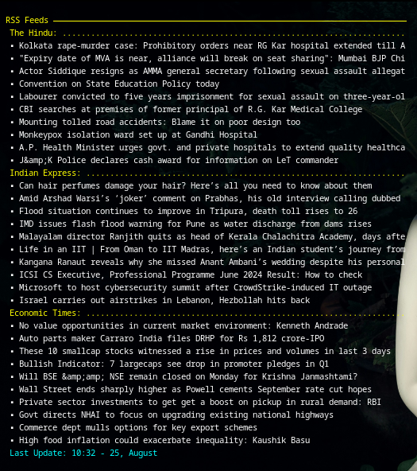

# प्रोजेक्ट सूचना (Project Sūcanā)

This project is a Conky setup for displaying RSS feeds from selected news sources. It includes a bash script to fetch and cache the RSS feeds and a Conky configuration to display them on your desktop.

## Features

- Fetches RSS feeds from The Hindu and Indian Express.
- Displays formatted headlines on the desktop.
- Customizable display settings.
- Warning System In Case of No Internet Connection Available.


## Setup

1. **Copy the Conky Configuration File**:
   Place the Conky configuration file (`suchanaa.conkyrc`) in your `.conkyrc` directory.
   In My-Case it was:
   ~/.config/conky/suchanaa.conkyrc (I have Created the `/conky` Directory inside ~/.config Directory)

2. **Configure the Bash Script**:
   Place the Bash configuration file (`rssfdconky.sh`) in your `~/bin` directory.
   To Copy This file:
   ```bash
   cp rssfdconky.sh ~/bin/rssfdconky.sh

   Ensure that both scripts have the correct permissions:
   ```bash
   chmod +x rssfdconky.sh

3. **Run Conky Script**
    ```bash
    conky -c /path/to/rss_conky_script.conkyrc

# Conky RSS Feed Display

This project configures Conky to display RSS feeds directly on your desktop. The setup fetches news headlines from specific RSS feeds and displays them in a clean, minimalistic format. Below are some examples of how the setup looks on different configurations.

## Display Examples

### With Internet Connection


### With No Internet Connection


### Full Screen Display


